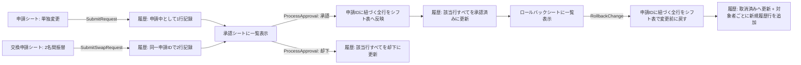

# システム設計(勤務変更申請・承認システム)

## 方式

Excel マクロ(VBA)のみで構成する、サーバーレスの申請・承認ワークフロー。
共有フォルダに置いた1つの `.xlsm` ファイルを複数PCから開いて利用する。

## シート構成

| シート | 役割 | 表示 |
|---|---|---|
| シフト表 | 実際のシフトデータ(マスタ)。マクロ経由でのみ更新される。 | 表示 |
| 申請 | 勤務変更申請(単独・本人の勤務を変更)の入力フォーム | 表示 |
| 交換申請 | 2名間の勤務交換(振替)申請の入力フォーム | 表示 |
| 承認 | 承認/却下の入力フォーム + 承認待ち一覧 | 表示 |
| ロールバック | 承認済み変更の取り消しフォーム + 承認済み一覧 | 表示 |
| 履歴 | 全操作の監査ログ(申請・承認・却下・取消) | 表示(保護あり) |
| 職員マスタ | 氏名・権限・パスワードのソルト付きハッシュ | 非表示(veryHidden) |
| 設定 | 対象年月・申請ID採番カウンタ | 非表示(veryHidden) |

## データフロー

単独の勤務変更申請は「申請ID 1件 = 履歴 1行」、2名間の交換申請は
「申請ID 1件 = 履歴 2行(対象者A分・対象者B分)」という関係になる。
承認・却下・ロールバックはすべて「同じ申請IDに紐づく履歴行をまとめて処理する」
共通のロジック(`FindHistoryRowsById`)で扱われるため、単独申請と交換申請は
同じ承認・ロールバックの仕組みをそのまま利用できる。

## 権限・認証モデル

- 職員ごとに「氏名 / 権限区分(一般 or 一般・承認者) / ソルト / SHA-256ハッシュ」を
  `職員マスタ` シートに保持する。
- パスワードは平文で保存しない。`SHA256(salt & password)` のみを保存し、
  入力時は都度同じ計算をして一致を確認する(`modSecurity.bas`)。
- SHA-256 の実装は Windows CryptoAPI(`advapi32.dll`)を `Declare` 文で直接呼び出しており、
  外部ライブラリや参照設定の追加は不要。
- 承認・ロールバックには「権限区分に "承認者" を含む」職員のパスワード照合が必須。
  申請には権限区分を問わず、本人のパスワード照合のみが必要。

## 監査ログ(履歴シート)の設計

1行 = 1人分の勤務セル変更。以下の列を持つ。

`申請ID / 申請日時 / 申請者 / 対象者 / 対象日 / 変更前 / 変更後 / 変更理由 / ステータス / 承認者 / 承認(処理)日時 / 元申請ID`

- **申請者**(誰が申請したか)と**対象者**(誰の勤務が変わるか)を別列で持つ。
  単独申請では両者は同一人物だが、交換申請では申請者1名に対し、対象者A・対象者Bの
  2行が同じ申請IDで記録されるため、「誰の申請で・誰と誰の・どんな変更か」が
  履歴上で具体的に区別できる。
- ステータスは `申請中 → 承認 / 却下`、または `承認 → 取消(ロールバック)` と遷移する。
- ロールバック実行時は、元の履歴行のステータスを更新するだけでなく、
  **新しい履歴行を追加**して「誰が・いつ・誰の・どの申請番号を取り消したか」を別途記録する
  (`元申請ID` 列で元の申請とひも付く)。既存行を書き換えるだけだと、取り消し操作自体の
  実施者・日時が失われてしまうため。
- 行は追記のみ(上書き・削除はしない)ため、シフト表がどう変遷してきたかを
  最初から最後まで追跡できる。

## シフト表への反映ロジック

- `シフト表` シートは 3行目に日付(1〜31の固定値)、5行目以降に職員名の行を持つ、
  行=職員・列=日付のマトリクス構造(元のExcelシフト表と同じレイアウト思想)。
- 対象セルは「対象者の行」×「対象日の列」で一意に特定する(`FindShiftStaffRow` /
  `FindShiftDayColumn`)。
- 承認・ロールバックの直前に、シフト表の実際の値と履歴上の期待値を突き合わせ、
  食い違いがあれば警告ダイアログを出す(他の操作で既に値が変わっていた場合の
  競合検知)。

## 既知の制約

- Excel 1ファイル共有方式のため、複数人が同時に「編集モード」で開いた場合の
  競合は Excel 標準の制御に依存する(完全な同時書き込み制御はできない)。
  運用ルール(閲覧は読み取り専用で開く等)でカバーする前提。
- シート保護のパスワードは誤操作防止であり、真のアクセス制御はパスワードハッシュ照合。
- パスワード入力欄はマスク表示されない(VBA標準のセル/InputBoxにはマスク機能がないため)。
- 将来、複数拠点からの同時アクセスやスマホからの申請が必須になった場合は、
  データベース + Webアプリ方式への移行を検討する(要件確認時に代替案として提示済み)。
